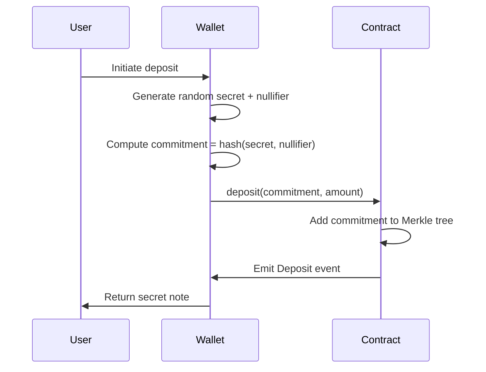
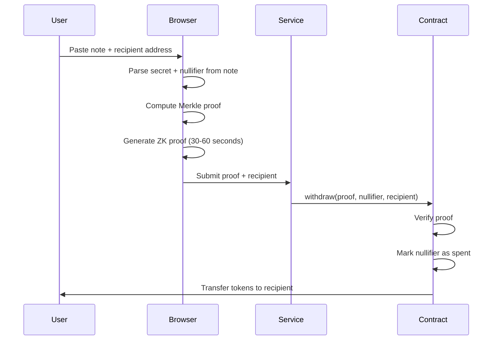

# How Dogenado Works

Dogenado uses **zero-knowledge cryptography** to enable private transactions. This page explains the technical concepts behind the protocol.

## The Privacy Problem

On public blockchains like DogeOS, all transactions are visible. Anyone can:
- See your wallet balance
- Track where you send funds
- Analyze your transaction history
- Link your real-world identity to your wallet

**Dogenado solves this by breaking the on-chain link between sender and receiver.**

## Anonymity Pools

The core of Dogenado consists of **anonymity pools** - smart contracts that:

1. Accept fixed-denomination deposits
2. Store all deposits together in a Merkle tree
3. Allow withdrawals using zero-knowledge proofs

```
┌─────────────────────────────────────────────────────┐
│                   Anonymity Pool                     │
│                                                      │
│  ┌─────┐  ┌─────┐  ┌─────┐  ┌─────┐  ┌─────┐       │
│  │ 100 │  │ 100 │  │ 100 │  │ 100 │  │ 100 │  ...  │
│  │USDC │  │USDC │  │USDC │  │USDC │  │USDC │       │
│  └─────┘  └─────┘  └─────┘  └─────┘  └─────┘       │
│     ↑        ↑        ↑        ↑        ↑          │
│   User A   User B   User C   User D   User E       │
│                                                      │
│  Anyone can withdraw 100 USDC with valid proof      │
│  No way to know which deposit it came from          │
└─────────────────────────────────────────────────────┘
```

## Zero-Knowledge Proofs

Dogenado uses **zkSNARKs** (Zero-Knowledge Succinct Non-Interactive Argument of Knowledge) - a cryptographic method that allows you to prove something is true without revealing any information about it.

### What We Prove

When you withdraw, you prove:

1. ✅ **You know a secret** that corresponds to a deposit in the pool
2. ✅ **The deposit exists** in the Merkle tree
3. ✅ **You haven't withdrawn before** (nullifier hasn't been used)

### What Stays Hidden

The proof reveals **nothing** about:

- ❌ Which deposit is yours
- ❌ When you deposited
- ❌ Your original wallet address

## The Deposit Process



### Step by Step:

1. **Generate Secrets**: Your browser generates two random values:
   - **Secret**: Random 31-byte value
   - **Nullifier**: Random 31-byte value

2. **Compute Commitment**: These are hashed together using Pedersen hash:
   ```
   commitment = PedersenHash(nullifier, secret)
   ```

3. **Deposit**: The commitment is stored in the smart contract's Merkle tree

4. **Receive Note**: You get a note containing your secret and nullifier:
   ```
   dogenado-usdc100-1-0x[commitment][nullifier][secret]
   ```

:::danger Important
**SAVE YOUR NOTE SECURELY!** This is the only way to withdraw your funds. If lost, funds are unrecoverable.
:::

## The Withdrawal Process



### Step by Step:

1. **Parse Note**: Extract secret and nullifier from your note

2. **Compute Merkle Proof**: Find your commitment in the tree and generate a path proof

3. **Generate ZK Proof**: Create a zero-knowledge proof that proves:
   - You know the secret for a commitment in the tree
   - The nullifier hash hasn't been used

4. **Submit Withdrawal**: The proof is submitted to the smart contract

5. **Receive Funds**: Contract verifies the proof and sends tokens to your recipient address

## The Nullifier System

To prevent double-spending, each deposit has a **nullifier**:

```
nullifierHash = hash(nullifier)
```

When you withdraw:
1. The nullifier hash is computed
2. Contract checks if this hash was used before
3. If unused, withdrawal proceeds and hash is marked as spent
4. If used, withdrawal is rejected

This ensures each deposit can only be withdrawn once, without revealing which deposit it was.

## Merkle Trees

All commitments are stored in a **Merkle tree** - a data structure that allows efficient proofs of membership:

```
                    Root
                   /    \
                 H12     H34
                /   \   /   \
              H1    H2 H3   H4
              |     |   |    |
             C1    C2  C3   C4
           (deposits/commitments)
```

To prove your deposit exists, you only need:
- Your commitment
- The sibling hashes along the path to the root

This is much more efficient than checking every deposit.

## Timelock Withdrawals (Optional)

For enhanced security, Dogenado offers **timelock withdrawals**:

| Option | Delay | Use Case |
|--------|-------|----------|
| Instant | 0 | Quick access when needed |
| 1 Hour | 3600s | Balance speed and security |
| 24 Hours | 86400s | Maximum privacy |

Longer delays increase privacy by:
- Allowing more deposits to accumulate
- Making timing analysis harder
- Reducing correlation between deposit and withdrawal times

## Privacy Considerations

The strength of your privacy depends on:

1. **Anonymity Set Size**: More deposits = better privacy
2. **Time Between Deposit and Withdrawal**: Longer = better
3. **Withdrawal Amount**: Using exact deposit amounts
4. **Recipient Address**: Should be a fresh address

See [Tips for Anonymity](/user-guide/tips-anonymity) for best practices.

---

## Further Reading

- [Technical Architecture](/technical/architecture)
- [Smart Contracts](/technical/smart-contracts)
- [Zero-Knowledge Deep Dive](/technical/zero-knowledge)

