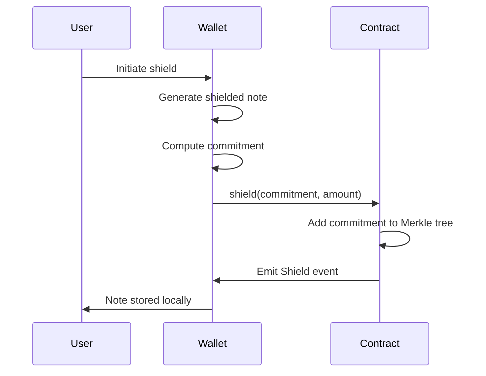
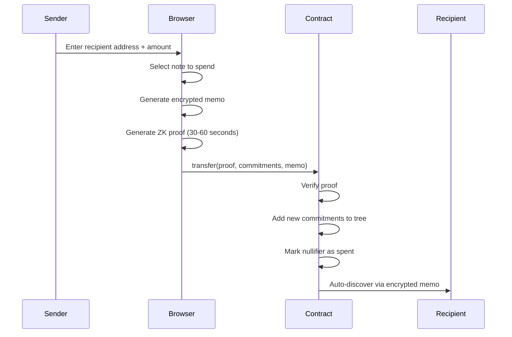
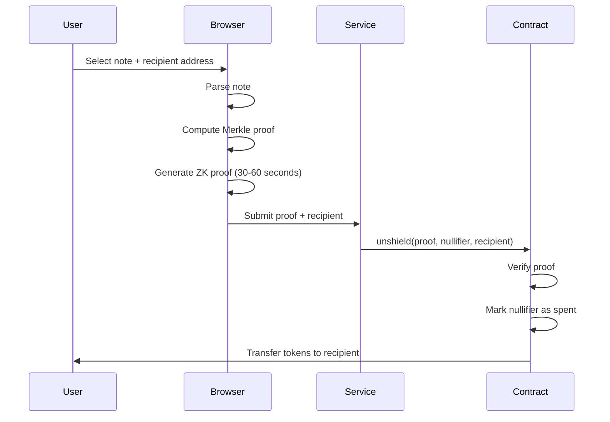

# How zDoge Works

zDoge uses **zero-knowledge cryptography** to enable private transactions. This page explains the technical concepts behind the protocol.

## The Privacy Problem

On public blockchains like DogeOS, all transactions are visible. Anyone can:
- See your wallet balance
- Track where you send funds
- Analyze your transaction history
- Link your real-world identity to your wallet

**zDoge solves this by enabling fully private transactions that hide sender, recipient, and amount.**

## Shielded Transactions

zDoge implements a **Zcash-style shielded transaction system** that enables:

1. **Shield (t→z)**: Convert public tokens to private shielded notes
2. **Transfer (z→z)**: Send tokens privately between shielded addresses
3. **Swap (z→z)**: Exchange tokens within the shielded layer
4. **Unshield (z→t)**: Convert shielded notes back to public tokens

All transactions use zero-knowledge proofs to prove validity without revealing any details.

```mermaid
graph TB
    subgraph Pool["Shielded Transaction Pool"]
        N1["Note 1<br/>50 DOGE"]
        N2["Note 2<br/>100 DOGE"]
        N3["Note 3<br/>25 DOGE"]
        N4["Note 4<br/>200 DOGE"]
    end
    
    U1["User A"] --> N1
    U2["User B"] --> N2
    U3["User C"] --> N3
    U4["User D"] --> N4
    
    style Pool fill:#1a1a1a,stroke:#C2A633,stroke-width:2px
    style N1 fill:#0d0d0d,stroke:#C2A633,stroke-width:1px
    style N2 fill:#0d0d0d,stroke:#C2A633,stroke-width:1px
    style N3 fill:#0d0d0d,stroke:#C2A633,stroke-width:1px
    style N4 fill:#0d0d0d,stroke:#C2A633,stroke-width:1px
```



**Key Properties:**
- All notes are private - amounts hidden on-chain
- Transfers hide sender, recipient, and amount
- Only the note owner can spend their notes

## Zero-Knowledge Proofs

zDoge uses **zkSNARKs** (Zero-Knowledge Succinct Non-Interactive Argument of Knowledge) - a cryptographic method that allows you to prove something is true without revealing any information about it.

### What We Prove

When you make a shielded transaction, you prove:

1. **You own a valid note** in the Merkle tree
2. **The transaction is valid** (value conservation, proper nullifiers)
3. **You haven't spent this note before** (nullifier hasn't been used)

### What Stays Hidden

The proof reveals **nothing** about:
- Which note you're spending
- The transaction amount
- The recipient's identity
- Your identity
- When the note was created

## Shield Process (Public → Private)



### Step by Step:

1. **Generate Shielded Note**: Your browser generates:
   - **Amount**: The amount to shield
   - **Secret**: Random value for the note
   - **Blinding**: Random value for privacy
   - **Commitment**: Hash of amount, secret, and blinding

2. **Compute Commitment**: The commitment is computed:
   ```
   commitment = MiMC(amount, secret, blinding, token)
   ```

3. **Shield**: The commitment is stored in the smart contract's Merkle tree

4. **Store Note**: The note is stored locally in your wallet

## Transfer Process (Private → Private)



### Step by Step:

1. **Select Note**: Choose a shielded note to spend

2. **Enter Recipient**: Provide recipient's shielded address (zdoge:...)

3. **Generate Encrypted Memo**: Create encrypted memo containing:
   - Note details for recipient
   - Ephemeral public key
   - Encrypted with recipient's shielded address

4. **Generate ZK Proof**: Create a zero-knowledge proof that proves:
   - You own a valid note in the tree
   - Value is conserved (input = output1 + output2 + fee)
   - Nullifier hasn't been used

5. **Submit Transfer**: The proof is submitted to the smart contract

6. **Auto-Discovery**: Recipient's wallet automatically discovers the incoming transfer via encrypted memo

## Unshield Process (Private → Public)



### Step by Step:

1. **Select Note**: Choose a shielded note to unshield

2. **Enter Recipient**: Provide public wallet address (0x...)

3. **Generate ZK Proof**: Create a zero-knowledge proof that proves:
   - You own a valid note in the tree
   - The nullifier hash hasn't been used

4. **Submit Unshield**: The proof is submitted to the smart contract

5. **Receive Funds**: Contract verifies the proof and sends tokens to your recipient address

## The Nullifier System

To prevent double-spending, each note has a **nullifier**:

```
nullifierHash = MiMC(nullifier, secret)
```

When you spend a note:
1. The nullifier hash is computed
2. Contract checks if this hash was used before
3. If unused, transaction proceeds and hash is marked as spent
4. If used, transaction is rejected

This ensures each note can only be spent once, without revealing which note it was.

## Merkle Trees

All commitments are stored in a **Merkle tree** - a data structure that allows efficient proofs of membership:

```
                    Root
                   /    \
                 H12     H34
                /   \   /   \
              H1    H2 H3   H4
              |     |   |    |
             C1    C2  C3   C4
        (shielded notes/commitments)
```

To prove your note exists, you only need:
- Your commitment
- The sibling hashes along the path to the root

This is much more efficient than checking every note.

## Encrypted Memos & Auto-Discovery

For private transfers, zDoge uses **encrypted memos** to enable auto-discovery:

1. **Encryption**: Sender encrypts note details using recipient's shielded address
2. **On-Chain Storage**: Encrypted memo is stored in the Transfer event
3. **Auto-Discovery**: Recipient's wallet scans for new transfers
4. **Decryption**: Recipient decrypts memo using their spending key
5. **Note Addition**: New note is automatically added to recipient's wallet

This enables seamless private transfers without manual note sharing.

## Privacy Considerations

The strength of your privacy depends on:

1. **Anonymity Set Size**: More shielded notes = better privacy
2. **Time Between Transactions**: Longer = better
3. **Transaction Patterns**: Vary amounts and timing
4. **Recipient Addresses**: Use fresh addresses when unshielding

See [Tips for Anonymity](/user-guide/tips-anonymity) for best practices.

---

## Further Reading

- [Technical Architecture](/technical/architecture)
- [Smart Contracts](/technical/smart-contracts)
- [Zero-Knowledge Deep Dive](/technical/zero-knowledge)
