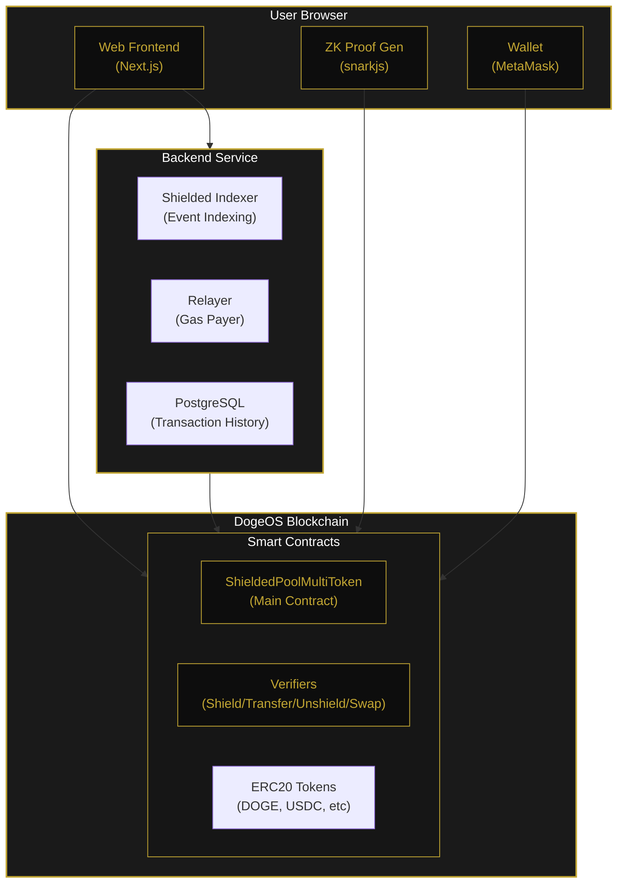
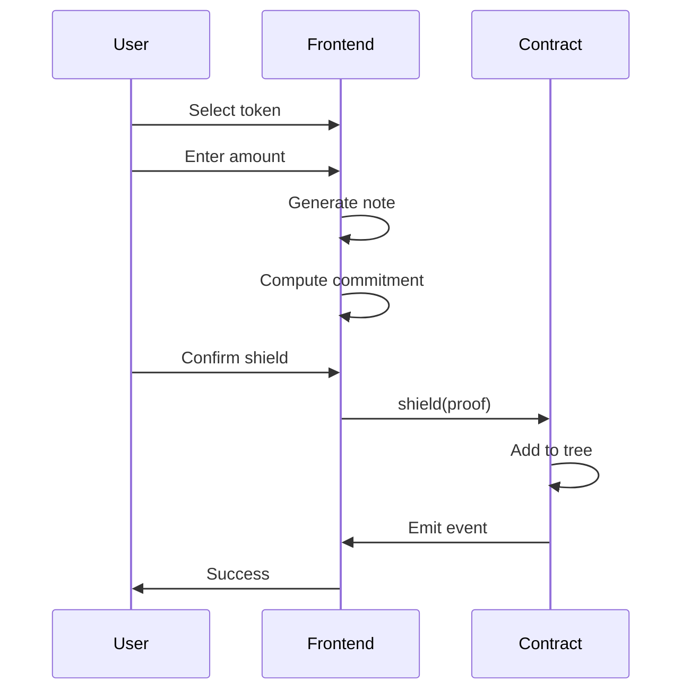
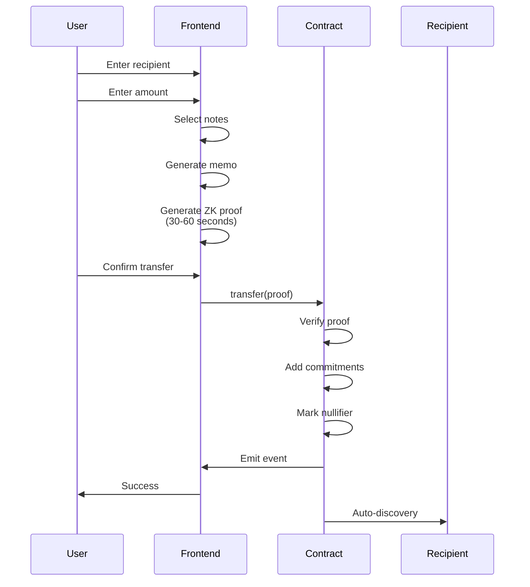

# Architecture Overview

zDoge is built on a multi-layer architecture designed for security, privacy, and scalability using Zcash-style shielded transactions.

## System Components



## Frontend Layer

The web interface is built with **Next.js** and runs entirely in the user's browser.

### Key Responsibilities

| Component | Function |
|-----------|----------|
| **Shield UI** | Token selection, amount entry, transaction submission |
| **Transfer UI** | Recipient entry, note selection, proof generation |
| **Unshield UI** | Recipient entry, note selection, proof generation |
| **Swap UI** | Token pair selection, amount entry, proof generation |
| **Proof Generation** | Client-side ZK proof generation using snarkjs |
| **Auto-Discovery** | Scanning for incoming transfers, memo decryption |
| **Wallet Integration** | MetaMask, WalletConnect for transaction signing |

### Client-Side Proof Generation

Zero-knowledge proofs are generated entirely in the browser:

1. User initiates transaction (shield/transfer/unshield/swap)
2. Browser selects notes and generates proof inputs
3. snarkjs generates Groth16 proof (~30-60 seconds)
4. Proof is submitted to blockchain

This ensures the user's secrets never leave their device.

## Smart Contract Layer

All shielded transaction logic runs on DogeOS smart contracts.

### ShieldedPoolMultiToken Contract

The main contract handling all shielded operations:

```solidity
contract ShieldedPoolMultiToken {
    // Configuration
    IShieldVerifier public shieldVerifier;
    ITransferVerifier public transferVerifier;
    IUnshieldVerifier public unshieldVerifier;
    ISwapVerifier public swapVerifier;
    
    // State
    mapping(bytes32 => bool) public nullifierHashes;
    MerkleTree public tree;
    
    // Functions
    function shield(bytes calldata proof, bytes32 commitment, ...) external;
    function transfer(bytes calldata proof, bytes32[2] commitments, bytes[2] memos, ...) external;
    function unshield(bytes calldata proof, bytes32 nullifier, address recipient, ...) external;
    function swap(bytes calldata proof, bytes32 inputNullifier, bytes32 outputCommitment, ...) external;
}
```

### Verifier Contracts

Separate Groth16 verifiers for each transaction type:
- **ShieldVerifier** - Verifies shield proofs
- **TransferVerifier** - Verifies transfer proofs
- **UnshieldVerifier** - Verifies unshield proofs
- **SwapVerifier** - Verifies swap proofs

## Backend Layer

The backend provides indexing, relaying, and transaction history services.

### Shielded Indexer

- Watches Shield, Transfer, Unshield, Swap events
- Maintains shielded Merkle tree state
- Tracks nullifiers
- Stores encrypted memos for auto-discovery

### Relayer Service

- Submits transactions on behalf of users
- Pays gas fees (enables gasless transactions)
- Rate limiting and balance monitoring

### Transaction History

- PostgreSQL database for persistence
- Syncs transaction history across devices
- Stores all transaction types

## Data Flow

### Shield Flow (Public → Private)



### Transfer Flow (Private → Private)



## Security Model

### Trust Assumptions

| Component | Trust Level | Why |
|-----------|-------------|-----|
| Smart Contracts | Trustless | Code is law, immutable |
| ZK Circuits | Trustless | Mathematically verified |
| Frontend | Verify yourself | Open source, runs locally |
| Merkle Tree | Trustless | On-chain verification |
| Backend | Minimal trust | Only for indexing/relaying |

### What's Protected

- **Transaction links**: Cryptographically hidden
- **Amounts**: Hidden in all shielded transactions
- **Sender/Recipient**: Hidden in transfers
- **Spending keys**: Never leave user's browser

### What's Visible On-Chain

- Shield events (commitment, token, amount, time)
- Transfer events (nullifier, commitments, memos, time)
- Unshield events (nullifier, recipient, token, amount, time)
- Swap events (input nullifier, output commitment, tokens, time)

The link between transactions cannot be determined.

## Scalability

### Current Capacity

| Metric | Value |
|--------|-------|
| Merkle Tree Depth | 20 levels |
| Max Shielded Notes | 1,048,576 |
| Proof Generation | 30-60 seconds |
| On-chain Verification | ~300,000-500,000 gas |

### Future Improvements

- Layer 2 proof aggregation
- Batch transactions
- Cross-chain bridges
- Improved proof generation speed

---

**Next:** [Smart Contracts](/technical/smart-contracts)
